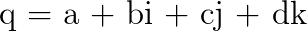
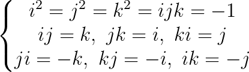
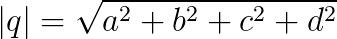
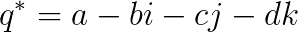
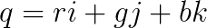
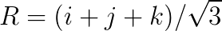
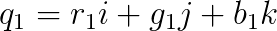
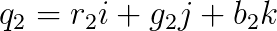
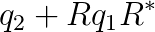
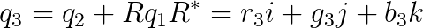

# 第二章 彩色梯度算法
本文提出的彩色图像梯度算法基于测量彩色图像方块内的局部对比度，这一设想与 `Di Zenzo` 的梯度算法思想类似。然而，本文提出的算法与 `Di Zenzo` 算法不同的地方在于我们并没有使用欧氏距离来衡量图像变换率，而是基于四元数旋转理论计算亮度变换和色度。

## 色彩距离的四元数表示
四元数理论在 `1843` 年被 `Hamilton` 提出，它是传统四元数的一般化形式。一个四元数由一个实部和三个虚部构成，它常常被表示成如下的代数形式：

其中 `a`、`b`、`c`、`d` 都是实系数，而 `i`、`j`、`k` 是按照如下规则进行运算的虚数单位：

四元数的模和共轭数的定义分别如下：

当四元数的实部为零，我们称之为纯四元数，当四元数的模为 `1`，我们称之为单位四元数。

一个彩色像素点可以使用一个纯四元数来表示，其三个虚部分别代表了彩色像素点的 `R`、`G`、`B` 三个通道。

假定一个单位纯四元数 `R` 和两个彩色像素点 `q1`、`q2`，他们的表示如下：

同时，我们将表达式

记录为 `q3`，即

