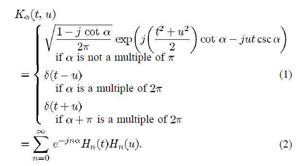
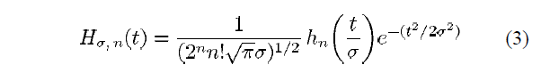
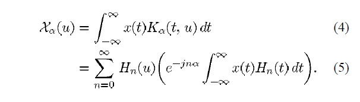
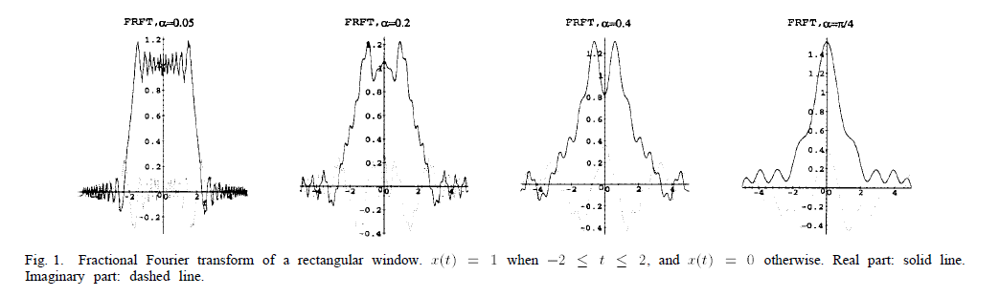
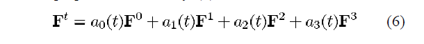
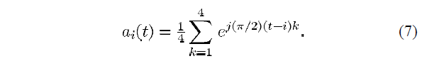
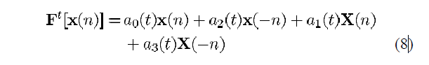
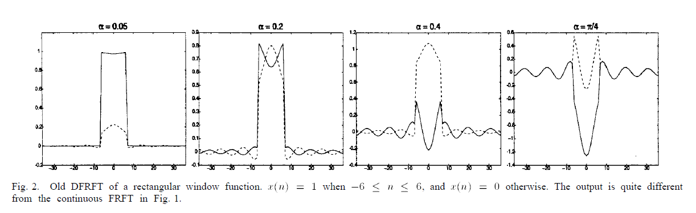
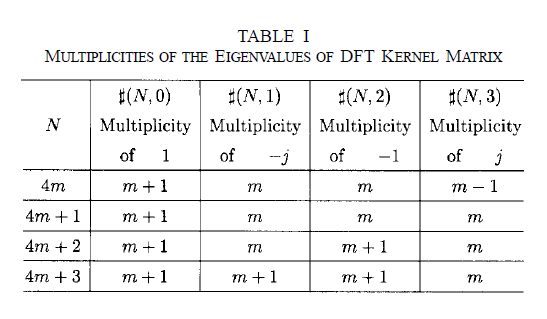

* 论文名：基于正交投影的离散分数阶傅里叶变换
* 作者：
    * `Soo-Chang Pei, Senior Member, IEEE`
    * `Min-Hung Yeh, Member, IEEE`
    * `Chien-Cheng Tseng, Member, IEEE`

---

# 概述
连续分数阶傅里叶变换( `FRFT`, `Fractional Fourier Transform` )使得数字信号能在时-频平面旋转，这使得它成为了信号时变分析的重要工具。最近 `Santhanam` 和 `McClellan` 提出了离散分数阶傅里叶变换，但是其结果并不完符合连续分数阶傅里叶变换的结果。在这篇论文中，我们提出了一种新的离散分数阶傅里叶变换( `DFRFT`, `Discrete Fractional Fourier Transform` )。这种新的 `DFRFT` 拥有 `DFT` 的厄米特特征向量，并且保持了连续 `FRFT` 的特征向量-特征值的对应关系。为了获取 `DFT` 的厄米特特征向量，我们提出了两种不同的正交投影方法。因此，我们提出的 `DFRFT` 将会具有与连续 `FRFT` 相似的的数学特性和旋转特性。此外，我们将会用类似传统 `DFT` 与连续傅里叶变换转换的方法建立起 `FRFT` 与 `DFRFT` 之间的联系。

关键字：**离散傅里叶变换**、**离散分数阶傅里叶变换**、**傅里叶变换**、**分数阶傅里叶变换**

# 第一章 介绍
傅里叶变换 ( `FT`, `Fourier Transform` ) 是信号分析领域使用最频繁的工具之一 `[1]`。而分数阶傅里叶变换( `FRFT`, `Fractional Fourier Transform` ) `[2,3]` 是傅里叶变换的一般化理论，在提出之际就成为了信号时变分析领域的重要工具。在信号时变分析中，人们习惯在时-频平面将时间、频率两根轴正交化 `[4]`。因为对原来信号连续做两次傅里叶变换能获得原来信号的相反信号，我们可以将其解释为傅里叶变换使得信号在时-频平面旋转了 `pi / 2` 度。而 `FRFT` 能让信号在连续的时-频平面旋转任意角度，这一特性用于获得线性调频信号的正交信号表示。在某些文档中，`FRFT` 也被称为旋转傅里叶变换 ( `Rotational Fourier Transform` ) 或角傅里叶变换 ( `Angular Fourier Transform` )。此外，作为 `FT` 的一般化理论，`FRFT` 也被证明与很多信号时变分析工具有关联，比如魏格纳分布 ( `Wigner Distribution` ) `[4]`，短时傅里叶变换 ( `Short-time Fourier Transform` ) `[4]`，小波变换 ( `Wavelet Transform` )等等。`FRFT` 的应用包括解决微分方程 `[2]` 、量子力学 `[3]`、光学信号处理 `[5]`、时变滤波和多路复用 `[5-8]`、摇频滤波 `[9]`、模式识别 `[10]` 和时-频信号分析 `[11-13]`。文献 `[9]` 总结了 `FRFT` 的一些性质。

很多 `FRFT` 的实现方法都已经被提出了，但是他们之中的绝大部分都是使用光学实现 `[14,15]` 或者数值化计算。因为 `FRFT` 是信号处理领域中潜在的有效工具，数字计算机中 `FRFT` 的直接数值计算已经成为了一个越来越重要的需求。理想状态下，`DFRFT` 将会成为 `DFT` 的一般化理论，并且遵循连续 `FRFT` 的旋转规则并且输出的结果将与 `FRFT` 非常相似。在文献 `[16]` 中，作者提出了一种 `FRFT` 的数值化计算方法，但是这种计算方法并不遵循旋转规则，并且信号无法通过逆变换来恢复。在文献 `[17]` 中，`Santhanam` 和 `McClellan` 也提出了一种离散 `FRFT`，但是他们的变换结果与连续 `FRFT` 的结果相差较大。在本文中，我们提出了一种新的离散分数阶傅里叶变换 ( `DFRFT`、`Discrete Fractional Fourier Transform` )。这种 `DFRFT` 是 `DFT` 的一般化理论，并且它的运算结果将与连续 `FRFT` 的结果大相径庭。通过这种方法，`DFRFT` 与 `FRFT` 的联系也能被建立起来，我们稍后将会讨论这个问题。并且，这种 `DFRFT` 还具有重要的酉性和旋转性。这篇论文按照如下的结构呈现：在第二章中，我们将会回顾之前提出的连续分数阶傅里叶变换；在第三章中，我们将会讨论与 `FRFT` 有着类似结果的 `DFRFT`，并且会提出两种可行的计算方法；在第四章中，我们将会建立起 `FRFT` 与 `DFRFT` 之间的联系；最后，我们会在第五章中做一些其他的讨论。

# 第二章 准备
## 2.1 连续分数阶傅里叶变换 ( FRFT )
信号的 `FT` 可以被认为是信号在时-频平面旋转了 `pi / 2` 度，而 `FRFT` 是 `FT` 的扩展，可以认为信号在时-频平面旋转了任意角度 `[9]`。`FRFT` 的变换核定义如下 `[2,3,6,9]`：

其中 `alpha` 表示了 `FRFT` 表换中信号的旋转角。`Hn(t)` 是方差为 `1` 的 `n` 阶归一化的厄米特函数。方差为 `sigma` 的 `n` 阶归一化的厄米特函数的定义如下：

其中 `hn(.)` 是 `n` 阶厄米特多项式 `[18]`。因为归一化的厄米特函数的方差为 `1`。`Hn(.)` 即是 `FRFT` 的特征函数，公式 `(2)` 提供了 `FRFT` 变换核的特征分解表示。文献 `[3]` 提供了 `(1)` 与 `(2)` 等价的证明。使用 `FRFT` 的变换核，在旋转角 `alpha` 下信号 `x(t)` 的 `FRFT` 可以按照如下方式计算：

等式 `(5)` 表明了 `FRFT` 可以被理解成厄米特函数的加权和。其中，权值系数可以通过计算相位项 `e^(-jn$alpha)` 与输入信号和连续厄米特函数的内积的积来获得。文献 `[19]` 提出了一种利用厄米特函数的旋转操作，并且信号旋转操作的输出依然是厄米特函数的加权和。然而 `[19]` 中提出的厄米特函数与 `FRFT` 中的厄米特函数有着不同的标度。因此，它在权值系数上拥有不同的相位项。

`Fig 1` 展示了方波 `x(t) = 1 for |t| <= 2; and x(t) = 0, elsewhere` 在许多角度下的 `FRFT`。在文本中，`FRFT`、`DFRFT` 变换结果的实部使用实线绘制，而虚部使用虚线绘制。

## 2.2 原有离散分数阶傅里叶变换 ( Old DFRFT )
`DFRFT` 的核矩阵可以通过计算 `DFT` 核矩阵的分数幂来获得。`DFT` 的分数幂和 `DFRFT` 中的旋转角本质上意味着类似的东西。为了防止含糊不清，在本文中，我们使用希腊字母下标 ( 比如 `alpha`、`Beta` ) 来表示时-频平面的旋转角，使用英文字母下表来表示 `DFR` 核矩阵的分数幂。文献 `[17]` 和 `[20]` 中提出的 `DFRFT` 的传统计算方法大多都是通过数值计算方法计算 `DFT` 核矩阵的分数幂。`DFT` 核矩阵的分数幂 `[20]` 可以按照如下方式计算：

其中：

将上面定义的变换核与信号 `x(n)` 结合，信号的 `DFRFT` 可以按照如下公式计算：

其中 `X(n)` 为信号 `x(n)` 的传统 `DFT`，等式 `(8)` 表明了信号 `x(n)` 的 `DFRFT` 与四个部分线性相关，他们分别是：原始信号 `x(n)`、其 `DFT` 变换 `X(n)`、信号 `x(n)` 的循环反射版本 `x(-n)` 以及 `x(-n)` 的 `DFT` 变换 `X(-n)`。

`Fig 2` 展示了方波 `N = 73, f(k) = 1, -6 <= k <= 6; otherwise f(k) = 0` 在不同角度下的 `DFRFT` 结果。可以看出 `Fig 2` 的结果与 `Fig 1` 的结果有着较大区别。此外，位于 `alpha = 0.2` 与 `alpha = pi / 4` 之间的 `alpha = 0.4` 的结果并不能作为两者联系的桥梁。

# 第三章 新离散分数阶傅里叶变换算法
## 3.1 离散分数阶傅里叶变换的特征分解
我们的 `DFRFT` 算法基于 `DFT` 核的特征分解，而文献 `[20,21]` 讨论了 `DFT` 矩阵的特征值和特征向量的许多特性。而在这里，我们只归纳部分对我们算法有用的特性。

命题 `1`：`F` 的特征值为 `{1, -j, -1, j}`，并且其数量满足表 `I` 的规律：

证明：参见文献 `[21]`。在表 `I` 中，我们定义了一种数量分布函数 `#(N, k)`。这个函数用于表示在 `N` 阶的情况下特征值的数量分布。参数 `k` 是指的是 `DFT` 特征值 `e^(-j(pi / 2)k)` 中的 `k`。